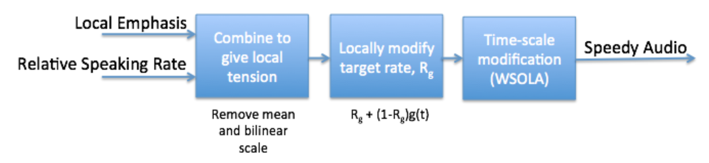
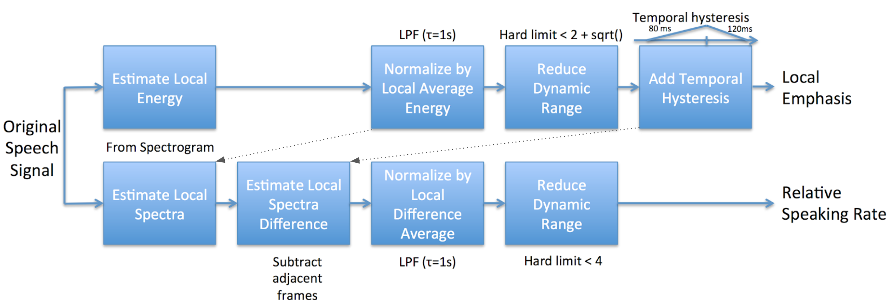

# Speedy - Nonlinear Speech Speedup

This is not an officially supported Google product.

This is Google's nonlinear speech speedup algorithm. The goal of this work is to
allow speech to be sped up non-linearly, where each portion of a word is sped up
at different rates, in a way that maintains intelligibility. Normal speed up
algorithms change all the parts of the speech at the same rate, i.e. 2x. But
when we speak faster, we don't say the words with constant speed. The vowels and
unstressed portions of the sound are easy to speedup and are greatly time
compressed. While consonants are already pretty short, and are important to
intelligibility, and are not sped up as much. Speedy attemptions to replicate
this idea in an automatic algorithm.

This is a reimplementation of the Mach1 algorithm published in this paper: M.
Covell, M. Withgott and M. Slaney, "MACH1: nonuniform time-scale modification of
speech," Proceedings of the 1998 IEEE International Conference on Acoustics,
Speech and Signal Processing, ICASSP '98 (Cat. No.98CH36181), 1998, pp. 349-352,
vol.1, doi: 10.1109/ICASSP.1998.674439.

https://ieeexplore.ieee.org/document/674439

## Usage

Speedy uses the
[same API](https://android.googlesource.com/platform/external/sonic/+/refs/heads/master/doc/index.md)
as the underlying [Sonic library](https://github.com/waywardgeek/sonic), but
adds one additional function, sonicEnableNonlinearSpeedup. \
The basic functionality is shown below.

```c
extern "C" {
include "sonic2.h"    /* From Speedy */
#include "speedy.h"  /* From Speedy */
}

  /* The audio processing pipeline follows. */

  int16_t* inputBuffer = new int16_t[numChannels*maxSamples];
  int16_t* outputBuffer = new int16_t[numChannels*maxSamples];

  sonicStream mySonicStream = sonicCreateStream(sampleRate, numChannels);
  sonicSetSpeed(mySonicStream, speed);

  sonicEnableNonlinearSpeedup(mySonicStream, nonlinear > 0.0,
                              normalization_time);

  while (1) {
    /* Send sampleCount samples from inputBuffer to Speedy/Sonic */
    int samples_written = sonicWriteShortToStream(mySonicStream, inputBuffer,
                                                  sampleCount);

    int soundSamplesFromSpeedy = sonicReadShortFromStream(mySonicStream,
                                                          outputBuffer,
                                                          maxSamples);
  }
```

## Results

Speedy is designed to mimic the way that humans speak faster, and by doing so
maintain the intelligibility of the original speech. In our case we measure
intelligibility using the TOEFL audio tests. Using Speedy we sped up 9 sample
stories by a factor of 3.5x, and then sped the story up linearly so that it has
the same overall length. We play a random story to a subject, ask the
comprehension questions, and then score their results. Their accuracy is a
measure of comprehension.

The results of our study, using Amazon Turk subjects, is shown below. We saw
better comprehension with Speedy speech. More than 50 subjects took our tests,
but not all were equally motivated. Thus the statistical significance of our
result depended on the subject. We *hypothesize* that subjects that only did one
or two tests were not motivated to do our task, and then quickly abandoned the
test. Ignoring the extremes of our subject pool, we saw significantly improved
comprehension results.


## Notes and implementation

The high-level flow chart for Speedy is shown below.


As part of this calculation the emphasis and relative speaking rate are
calculated as shown below (where solid and dotted lines show signal
dependencies). 

To plots below show the internal calculations for a single speaker speaking the
sentence "A huge tapestry hung in her hallway."


## Installation

The supplied Makefiles assume that sonic and speedy are in parallel directories.

```
.../sonic/...
.../speedy/...
```

By default, speedy depends on the [FFTW](https://www.fftw.org/) library.
You might be able to install it on your machine with `sudo apt-get install -y
fftw-dev`.

Then run the make command in both directories

```
cd .../sonic
make all
cd ../speedy
make all
```

The binary speedy_wave is a simple demonstration program.
